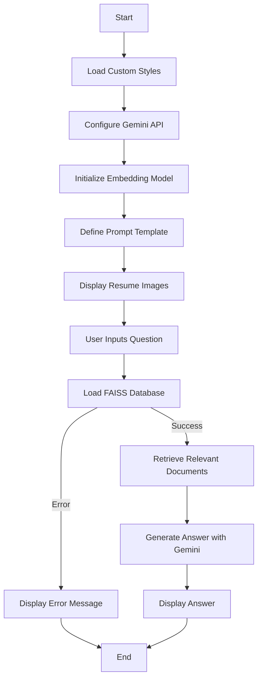

# **🔍 Advanced RAG Project**
[](https://wakatime.com/badge/user/ae82a943-125e-489a-a656-e35fe84d587b/project/5dd7cb9b-6471-4470-8eb9-06f7f1faf53d)

<!-- Badge to Visit Project -->
<div align="center">
    <a href="https://advanced-rag-project.streamlit.app/">
        
    </a>
</div>

---

## **📄 Overview**

The **Advanced RAG Project** (Retrieval-Augmented Generation) is an innovative application that leverages state-of-the-art technologies like **FAISS** and **Gemini** to offer a powerful Q&A interface based on Muhammad Fahmi's professional resume. This project integrates retrieval mechanisms with generative AI to provide concise and accurate answers based on a resume database. It’s a cutting-edge example of combining **AI embeddings** with user-friendly visualizations.

---

## **Table of Contents**

1. [🎯 Objectives](#-objectives)
2. [🔧 Technologies Used](#-technologies-used)
3. [📝 Directory Structure](#-directory-structure)
4. [🔍 Features](#-features)
5. [🔄 Project Workflow](#-project-workflow)
6. [🎉 Conclusion](#-conclusion)
7. [📚 References](#-references)
8. [📜 License](#-license)
9. [🗺️ Code Workflow](#-code-workflow)

---

## **🎯 Objectives**

- **🚀 Demonstrate advanced RAG workflows** by integrating retrieval and generative AI models.
- **🔍 Build an interactive resume Q&A interface** for professional inquiries.
- **🎓 Showcase the capabilities of FAISS and Gemini** in a real-world application.

---

## **🔧 Technologies Used**


Other libraries:
- **LangChain**: For prompt handling.
- **HuggingFace Embeddings**: For embedding generation.
- **PIL**: For image handling.
- **Gemini API**: For generative content creation.

---

## **📝 Directory Structure**

```plaintext
.
├── LICENSE
├── README.md              # Project documentation
├── streamlit_app.py       # Main application file
├── streamlit_app_openai.py# Alternative OpenAI app
├── component.py           # Custom UI components and styles
├── requirements.txt       # Dependencies for the project
├── assets                 # Background images and sounds
│   ├── backgrounds        # UI-related assets
│   └── sounds             # Placeholder for future sound features
├── photos                 # Additional project photos
├── Database               # Resume data for embedding retrieval
│   └── Resume             # Resume images (pages 1 and 2)
└── Drawing.drawio         # Flowchart for app workflow
```

---

## **🔍 Features**

### 1. **Interactive Resume Q&A**
- Ask **natural language questions** about Muhammad Fahmi’s resume and get accurate, concise answers.

### 2. **Resume Viewer**
- Visualize **both pages of the resume** in a clean, side-by-side interface.

### 3. **FAISS Database Integration**
- Utilize **efficient embedding-based retrieval** for fast and relevant document search.

### 4. **Gemini Generative Model**
- Generate detailed answers based on retrieved resume context using **Gemini 1.5 Flash**.

### 5. **Dynamic User Experience**
- Responsive, visually appealing **Streamlit interface**.

---

## **🔄 Project Workflow**

1. **🌐 Environment Setup**:
   - Install required libraries:

     ```bash
     pip install -r requirements.txt
     ```

   - Launch the app locally:

     ```bash
     streamlit run streamlit_app.py
     ```

2. **🔧 Database Preparation**:
   - Generate embeddings using **HuggingFace Models**.
   - Load embeddings into a **FAISS** index for fast retrieval.

3. **🚀 Application Integration**:
   - Set up **Gemini API** keys for generative responses.
   - Integrate retrieval and generation workflows into the **Streamlit app**.

4. **🎮 User Interaction**:
   - Users can ask questions, view resumes, and receive answers seamlessly.

5. **🔄 Continuous Improvement**:
   - Add new features, optimize embeddings, and improve app UX.

---

## **🗺️ Code Workflow**

The following Mermaid diagram illustrates the workflow of the code:



### How to Use Mermaid Diagrams

To render Mermaid diagrams in your Markdown files, you can use a Markdown viewer that supports Mermaid, such as:

- **Visual Studio Code** with the **Markdown Preview Mermaid Support** extension.
- **Typora**, a Markdown editor with built-in Mermaid support.
- **GitHub** (with Mermaid syntax highlighting) or **GitLab** (with Mermaid support enabled).

Simply copy the Mermaid code block into your Markdown file, and it will be rendered as a diagram when viewed with a compatible Markdown viewer.

---

## **🎉 Conclusion**

The **Advanced RAG Project** is a practical demonstration of retrieval-augmented generation for real-world applications. With **AI-powered Q&A** based on personal resume data, this project bridges the gap between machine intelligence and user-centric design. It’s an ideal showcase for exploring advanced AI workflows and interactive app development.

---

## **📚 References**

- [LangChain Documentation](https://docs.langchain.com/)
- [FAISS Documentation](https://faiss.ai/)
- [Streamlit Documentation](https://docs.streamlit.io/)
- [Gemini API Documentation](https://developers.google.com/genai)

---

## **📜 License**

**Fahmi Zainal Custom License**
Unauthorized copying, distribution, or modification of this project is prohibited. For inquiries, contact the project owner.
